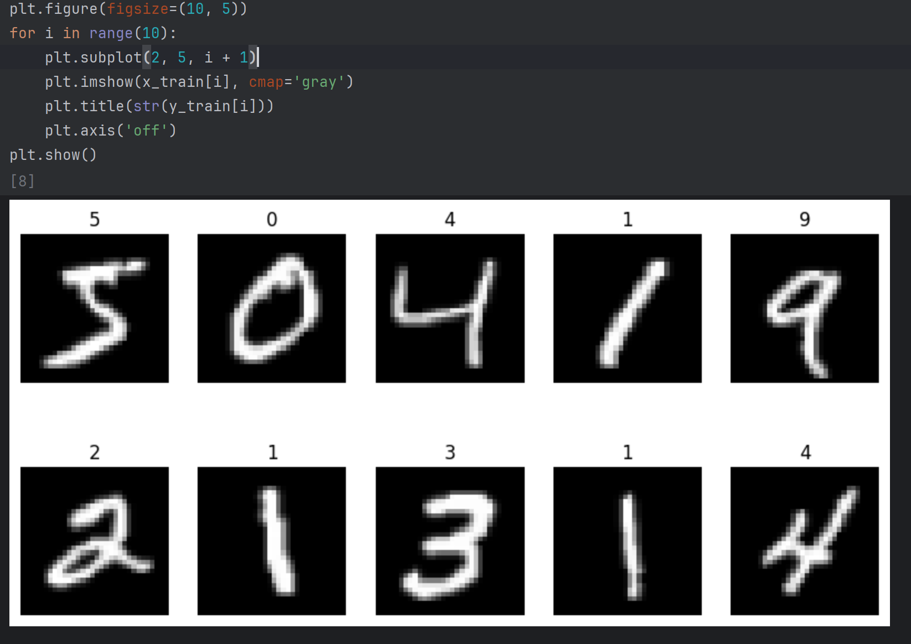
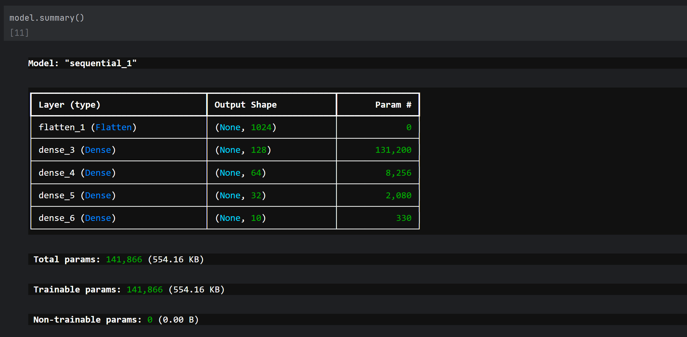
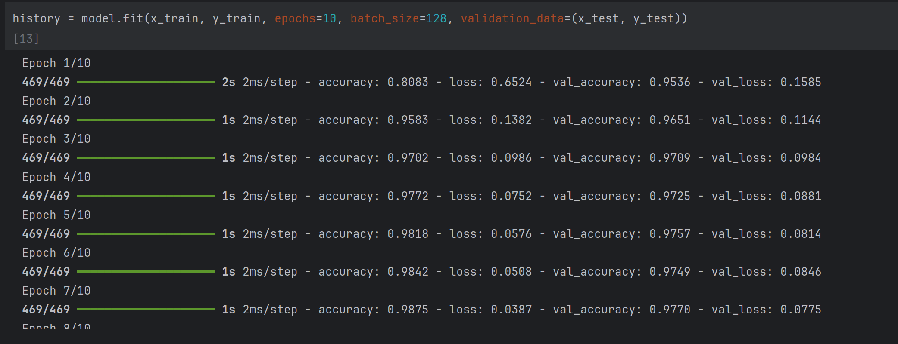
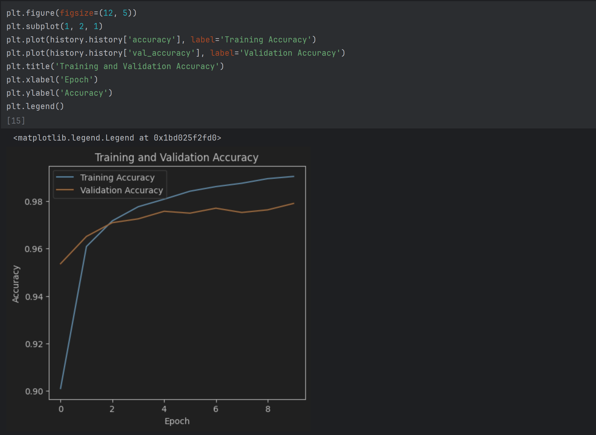

# ANN FeedForward MNIST
This repository contains a Jupyter Notebook that implements a Feedforward Neural Network (ANN) for classifying handwritten digits using the MNIST dataset. 
The model is built using TensorFlow/Keras and trained to recognize digits (0-9) with high accuracy.

## 🚀 Features
- ✅ Loads and preprocesses the MNIST dataset (28×28 grayscale images).
- ✅ Uses a fully connected neural network (ANN) for digit classification.
- ✅ Implements ReLU activation for hidden layers and Softmax activation for output.
- ✅ Optimized with Adam optimizer and trained using Sparse Categorical Crossentropy loss.
- ✅ Includes training, evaluation, and performance metrics.

## 🛠️ Technologies Used
- Python
- Jupyter Notebook
- NumPy (Data Handling)
- Matplotlib (Data Visualization)
- TensorFlow/Keras (Deep Learning)
- https://storage.googleapis.com/tensorflow/tf-keras-datasets/mnist.npz (Dataset)

## 📌 Screenshots

## 📌 Next Steps
- 🚀 Improve accuracy by tuning hyperparameters (batch size, learning rate, epochs).
- 📉 Implement Dropout & Batch Normalization to reduce overfitting.
- ⚡ Convert to a Convolutional Neural Network (CNN) for better performance.
- 📲 Deploy as a web app using Flask or FastAPI (Optional),

